# FK POS

**Küçük işletmeler için çevrimdışı çalışmayı esas alan satış noktası (POS) yazılımı.**
**Offline-first point-of-sale software for small businesses.**

🇹🇷 [Türkçe](#türkçe) · 🇬🇧 [English](#english)

  <a href="screenshots/03-yonetim-paneli.png">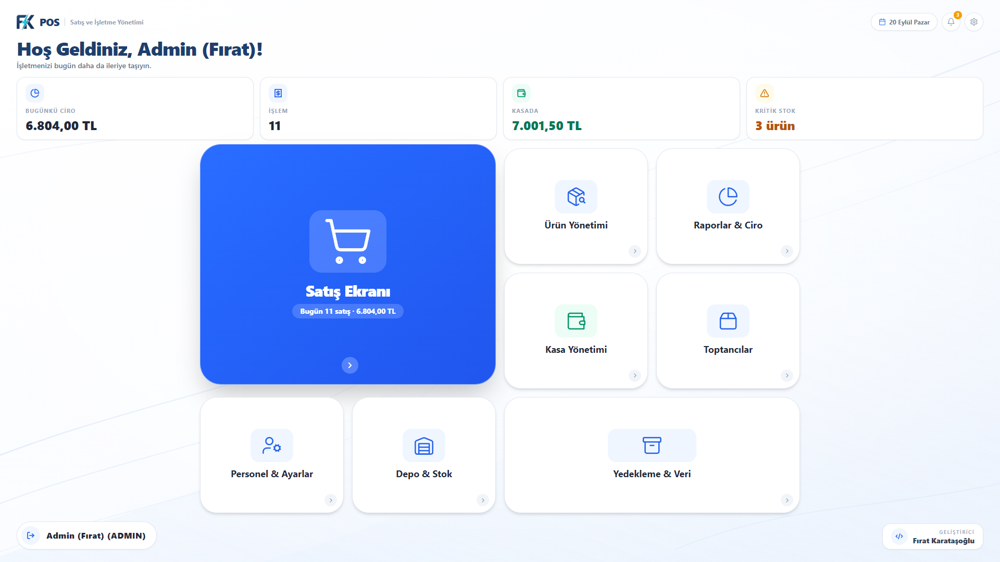</a>

---

## Türkçe

8 sektöre özel sürüm · 5 aktif işletme · Türkiye pazarı

→ [fkposyazilim.com](https://fkposyazilim.com)

> Bu bir vitrin (showcase) deposudur. FK POS ticari bir üründür, bu yüzden kaynak kodu açık değildir — bu sayfa ürünün mimarisini ve arkasındaki mühendislik kararlarını anlatır.

### Sorun

Bir dükkân, internet kesildi diye satış yapmayı bırakamaz. Modern POS yazılımlarının çoğu kesintisiz bir bağlantı varsayar ve bağlantı olmadığında kötü çalışır. FK POS bunun tersine kurgulanmıştır: gerçeğin kaynağı kasadır, bulut ise isteğe bağlı bir gözlemcidir.

### Mimari

**Önce çevrimdışı (offline-first).** Satış, kasa işlemleri, stok ve faturalama tamamen yerel makinede çalışır. Ödeme akışının hiçbir adımı için internet bağlantısı gerekmez.

**Eklenti olarak bulut senkronizasyonu.** İsteğe bağlı bir Supabase modülü, kasanın anlık durumunu her 2 dakikada bir ve bağlantı geri geldiğinde hemen gönderir. Böylece işletme sahibi dükkânı uzaktan izleyebilir, kasa ise çevrimdışı çalışmaya devam eder.

**Donanım Rust'ta.** Barkod okuyucular, elektronik teraziler, termal fiş yazıcıları ve ikinci müşteri ekranları, Rust ile yazılmış Tauri komutlarıyla sürülür; cihaz girdi/çıktısı JavaScript katmanının dışında tutulur.

**Tek dosya yedekler.** Özel bir .POS biçimi, tüm dükkân durumunu tek bir dosyada toplar — işletme sahibinin USB belleğe kopyalayabileceği kadar basit.

### Modüller

Satış · Stok · Cari hesaplar · Faturalama · Toplu fiyat güncelleme · Raporlama

### Teknoloji

React · TypeScript · Tauri · Rust · Supabase (PostgreSQL) · Windows

### Ekran görüntüleri

Görüntüler uydurma demo verisiyle alınmıştır. Büyütmek için üzerine tıklayın.

**Masaüstü uygulaması**

<table>
  <tr>
    <td align="center" width="50%"><a href="screenshots/01-giris-secimi.png">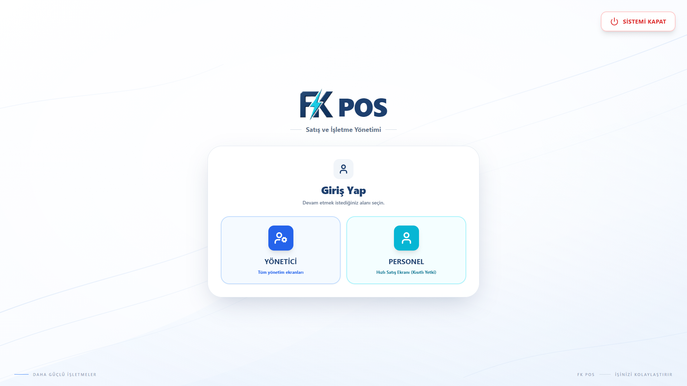</a> Giriş</td>
    <td align="center" width="50%"><a href="screenshots/02-pin-girisi.png">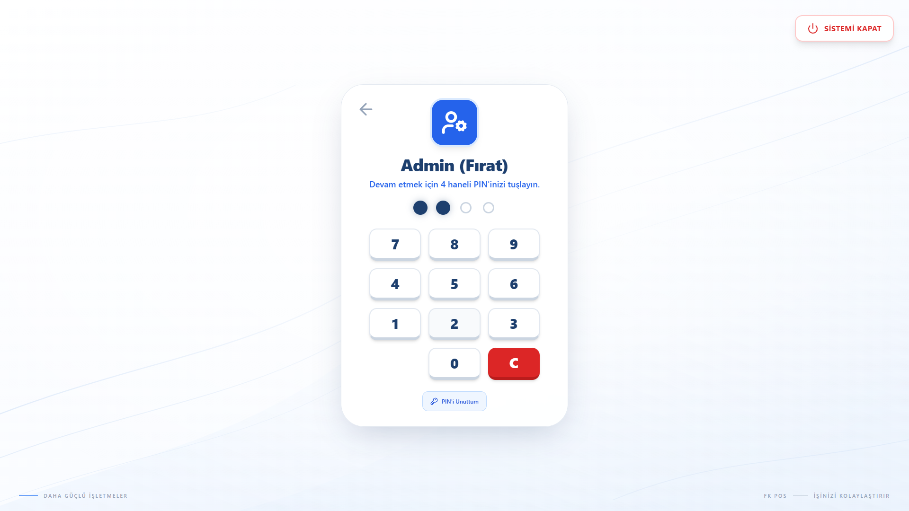</a> PIN ile giriş</td>
  </tr>
  <tr>
    <td align="center"><a href="screenshots/04-satis-ekrani.png">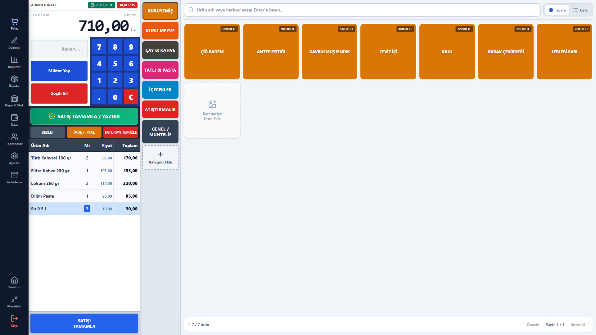</a> Satış ekranı</td>
    <td align="center"><a href="screenshots/05-urun-yonetimi.png">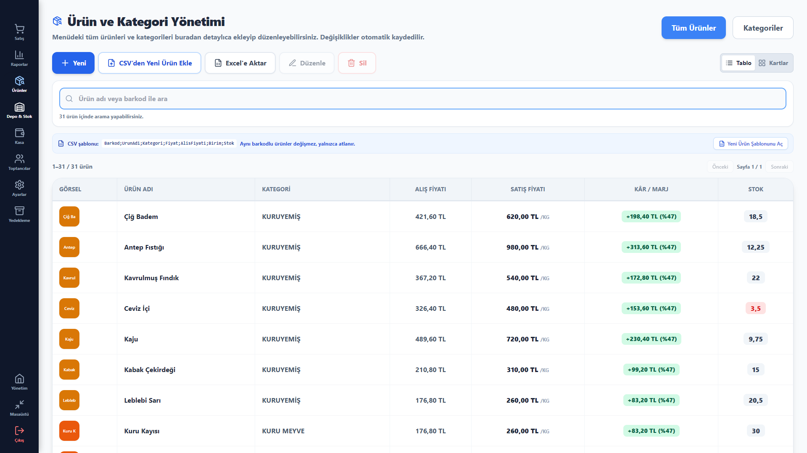</a> Ürün yönetimi</td>
  </tr>
  <tr>
    <td align="center"><a href="screenshots/06-raporlar.png">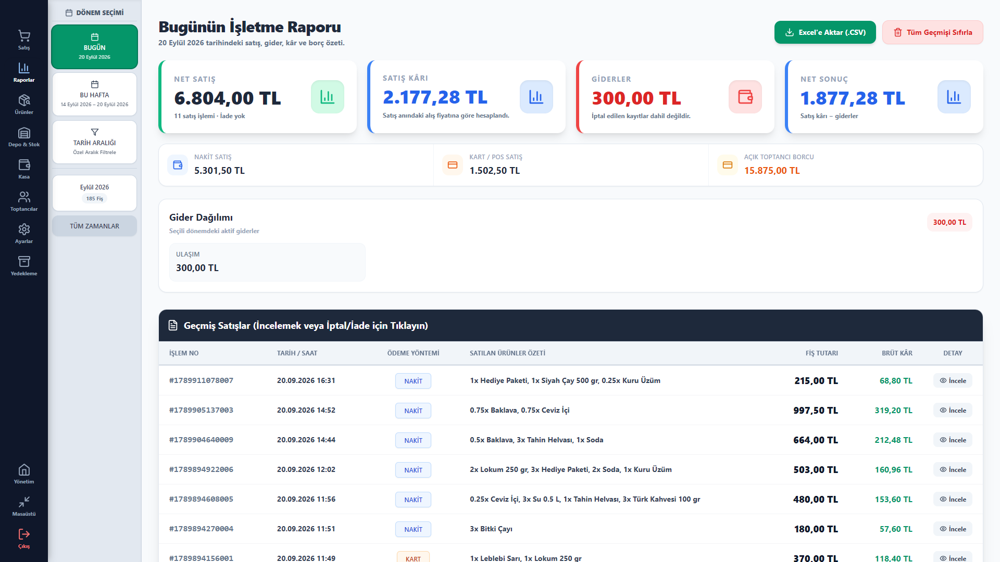</a> Raporlar</td>
    <td align="center"><a href="screenshots/07-kasa-yonetimi.png">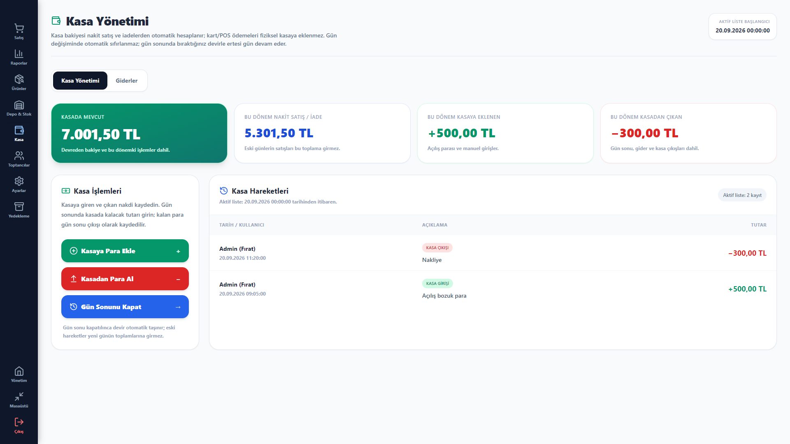</a> Kasa yönetimi</td>
  </tr>
  <tr>
    <td align="center"><a href="screenshots/08-depo-stok-kritik.png">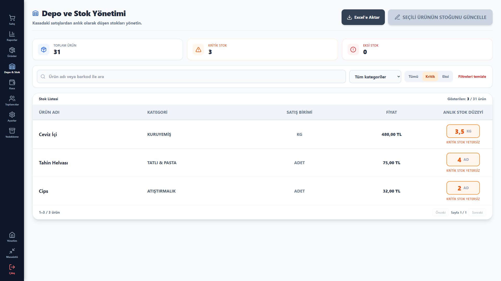</a> Depo ve kritik stok</td>
    <td align="center"><a href="screenshots/09-toptancilar.png">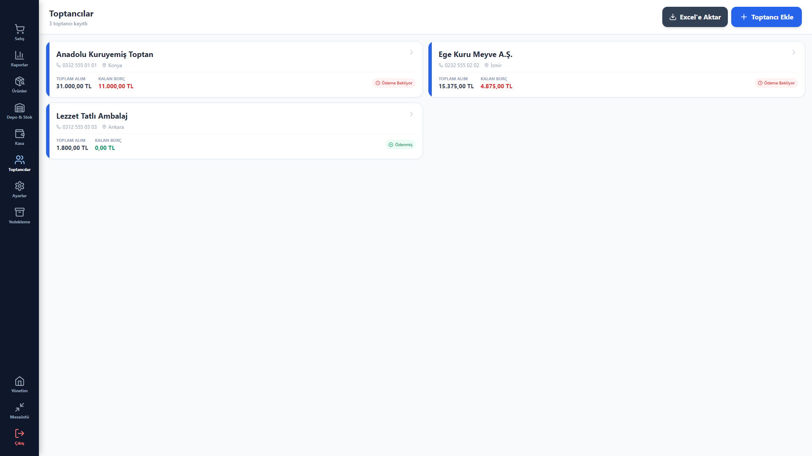</a> Toptancılar</td>
  </tr>
  <tr>
    <td align="center"><a href="screenshots/10-toptanci-detay.png">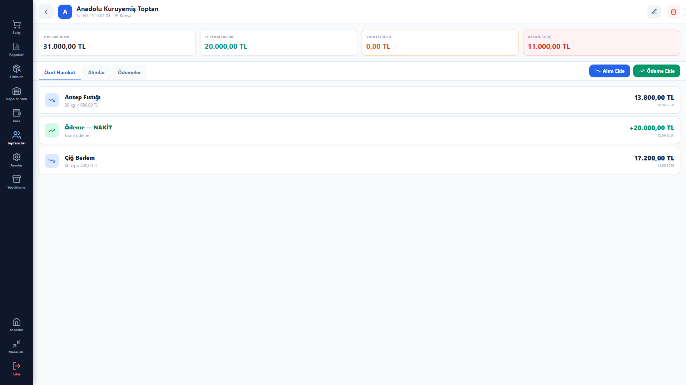</a> Toptancı detayı</td>
    <td align="center"><a href="screenshots/11-ayarlar-fis-tasarimi.png">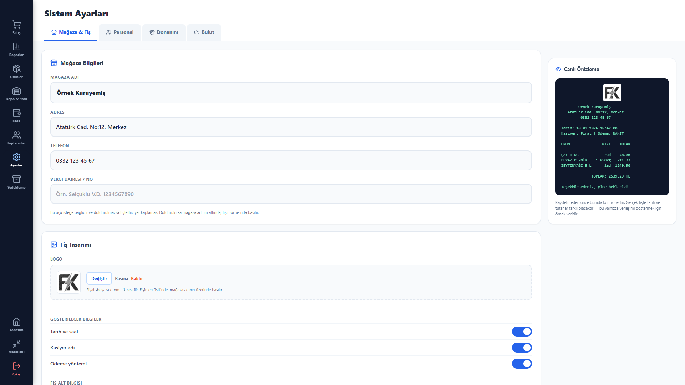</a> Fiş tasarımı (canlı önizleme)</td>
  </tr>
  <tr>
    <td align="center"><a href="screenshots/12-ayarlar-donanim.png">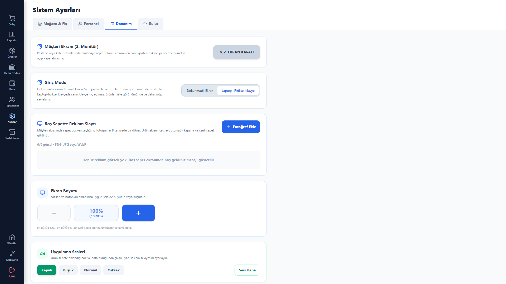</a> Donanım ayarları</td>
    <td></td>
  </tr>
</table>

**Telefon paneli (uzaktan takip)**

<table>
  <tr>
    <td align="center" width="25%"><a href="screenshots/remote-giris-aydinlik.png">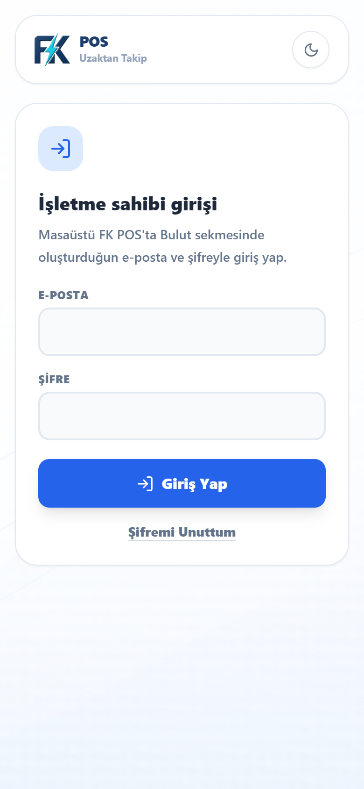</a> Giriş (aydınlık)</td>
    <td align="center" width="25%"><a href="screenshots/remote-giris-karanlik.png">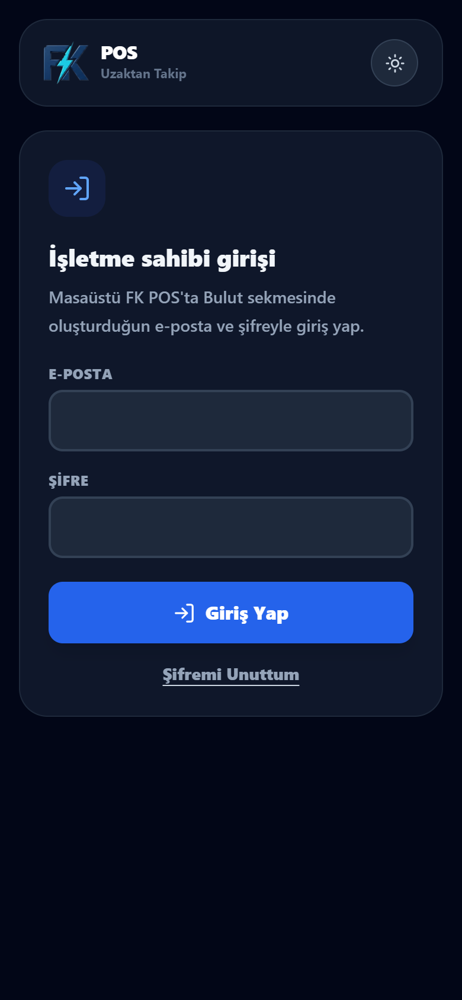</a> Giriş (karanlık)</td>
    <td align="center" width="25%"><a href="screenshots/remote-bugun-aydinlik.png">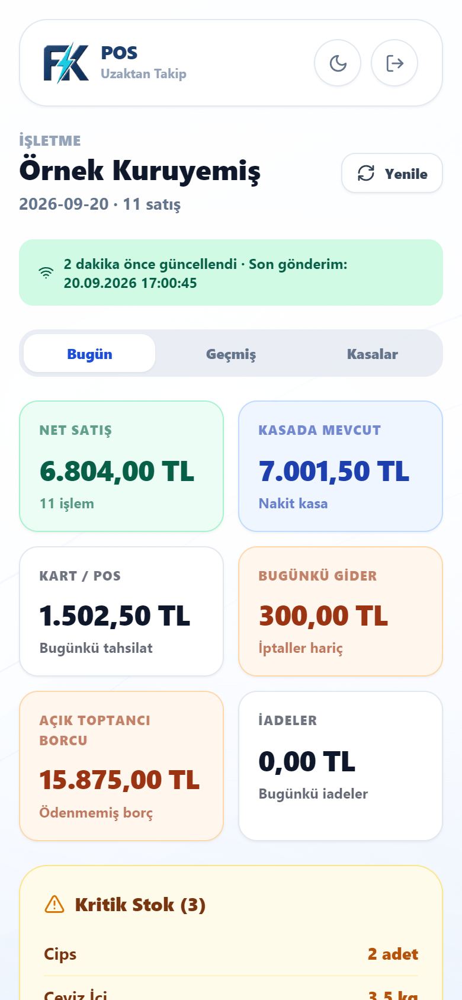</a> Bugün (aydınlık)</td>
    <td align="center" width="25%"><a href="screenshots/remote-bugun-karanlik.png">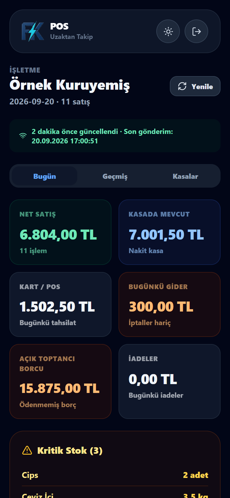</a> Bugün (karanlık)</td>
  </tr>
  <tr>
    <td align="center"><a href="screenshots/remote-bugun-devami-aydinlik.png">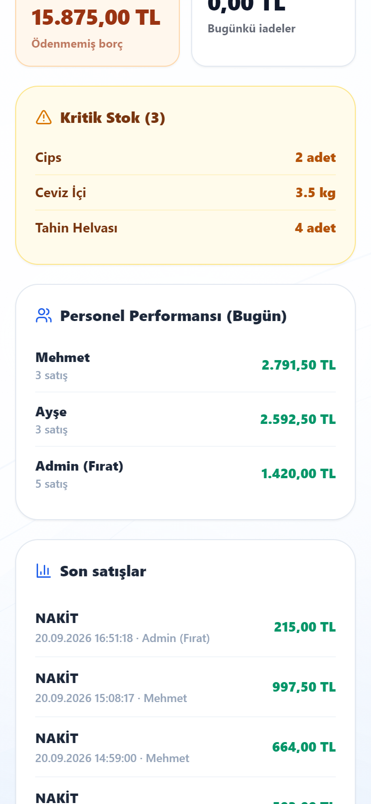</a> Kritik stok ve personel</td>
    <td align="center"><a href="screenshots/remote-gecmis-aydinlik.png">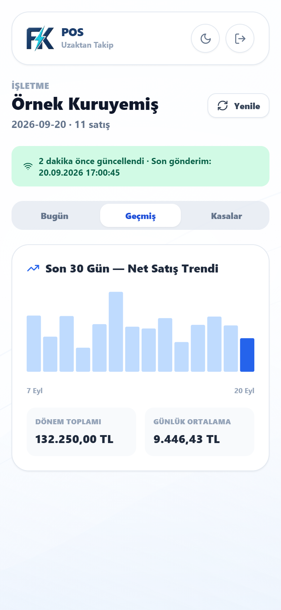</a> Geçmiş</td>
    <td align="center"><a href="screenshots/remote-kasalar-aydinlik.png">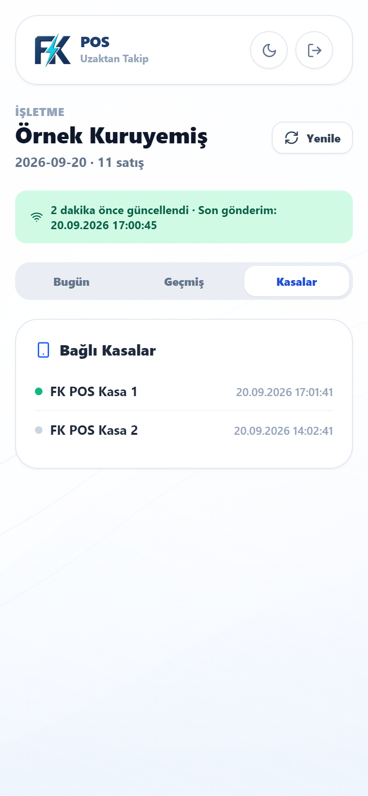</a> Kasalar</td>
    <td></td>
  </tr>
</table>

### Rolüm

Her şey: mimari, geliştirme, müşteri işletmelerinde yerinde kurulum ve sürekli destek.

---

[Fırat Karataşoğlu](https://github.com/frat-karatasoglu) tarafından geliştirilmekte ve sürdürülmektedir.

---

## English

8 industry-specific versions · 5 active businesses · Turkish market

→ [fkposyazilim.com](https://fkposyazilim.com)

> This is a showcase repository. FK POS is a commercial product, so the source code is not public — this page documents the architecture and the engineering decisions behind it.

### The problem

A shop cannot stop selling because the internet is down. Most modern POS software assumes a stable connection and degrades badly without one. FK POS is built the other way round: the register is the source of truth, and the cloud is an optional observer.

### Architecture

**Offline-first.** Sales, register operations, inventory and invoicing run entirely on the local machine. No connection is required for any part of the checkout flow.

**Cloud sync as an add-on.** An optional Supabase module pushes the current state of the register every 2 minutes, and immediately when connectivity returns, so the owner can watch the shop remotely while the till itself keeps working offline.

**Hardware in Rust.** Barcode scanners, electronic scales, thermal receipt printers and second customer displays are driven through Tauri commands in Rust, keeping device I/O out of the JavaScript layer.

**Single-file backups.** A custom .POS format packs the whole shop state into one file — simple enough for a shop owner to copy to a USB stick.

### Modules

Sales · Inventory · Accounts · Invoicing · Bulk price updates · Reporting

### Stack

React · TypeScript · Tauri · Rust · Supabase (PostgreSQL) · Windows

### Screenshots

Screenshots use fictitious demo data. Click an image to enlarge it.

**Desktop app**

<table>
  <tr>
    <td align="center" width="50%"> Sign-in</td>
    <td align="center" width="50%"> PIN sign-in</td>
  </tr>
  <tr>
    <td align="center"> Sales screen</td>
    <td align="center"> Product management</td>
  </tr>
  <tr>
    <td align="center"> Reports</td>
    <td align="center"> Cash register management</td>
  </tr>
  <tr>
    <td align="center"> Inventory &amp; low stock</td>
    <td align="center"> Suppliers</td>
  </tr>
  <tr>
    <td align="center"> Supplier detail</td>
    <td align="center"> Receipt designer (live preview)</td>
  </tr>
  <tr>
    <td align="center"> Hardware settings</td>
    <td></td>
  </tr>
</table>

**Phone panel (remote monitoring)**

<table>
  <tr>
    <td align="center" width="25%"> Sign-in (light)</td>
    <td align="center" width="25%"> Sign-in (dark)</td>
    <td align="center" width="25%"> Today (light)</td>
    <td align="center" width="25%"> Today (dark)</td>
  </tr>
  <tr>
    <td align="center"> Low stock &amp; staff</td>
    <td align="center"> History</td>
    <td align="center"> Registers</td>
    <td></td>
  </tr>
</table>

### My role

Everything: architecture, development, on-site installation at customer premises, and ongoing support.

---

Built and maintained by [Fırat Karataşoğlu](https://github.com/frat-karatasoglu).
